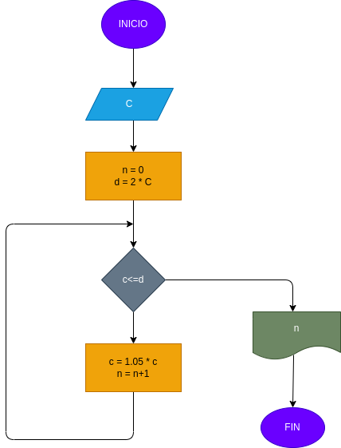

# Interes_Compuesto
Hacer el diagrama de flujo y el programa en python,que lea un capital c, y que averigua e imprima en cuantos meses se duplica si lo coloco en un interes compusto del 5%  mensual

Suma de la capital final al pasar n meses

# ANALISIS

Variablesde entrada

C= Capital Inicial

n= Numero de meses

d= Doble del capital inicial

Variables de proceso

C= 1.05*C

n= n+1

# DISEÑO

# CONSTRUCCION